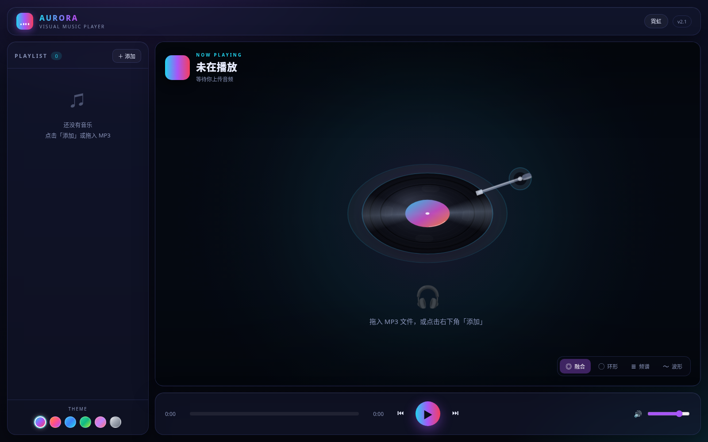

# Aurora — Visual Music Player

纯前端、零依赖的可视化音乐播放器。上传本地 MP3，随声起舞的霓虹可视化。

## 界面预览



桌面端默认界面：展示霓虹主题、中央黑胶舞台、可视化模式与播放控制。

## 功能
- 拖拽 / 点击上传 MP3（支持多首）
- **舞台中心 3D 黑胶唱机**：播放即转、暂停惯性减速、鼠标视差倾斜、点盘面播放/暂停
- Web Audio API 实时频谱分析
- 四种可视化模式：融合 / 环形 / 频谱 / 波形
- 节拍粒子、贝斯呼吸光晕、中心黑胶旋转
- 播放列表、进度/音量控制、键盘快捷键
- 6 套主题配色（霓虹/日落/深海/森林/糖果/极简），一键切换，本地记忆
- 精致 UI：顶部品牌栏、曲名哈希生成渐变封面、光晕进度滑块、模式药丸栏、播放态联动微动效

## 使用
浏览器直接打开 `music-player.html`，拖入 MP3 即可。零依赖、无需安装、运行时不发网络请求。

## 开发（v2.0 起）
`music-player.html` 是**构建产物**，请勿直接编辑；源码在 `src/`：

```
index.html                 Vite 入口（页面骨架）
src/main.js                装配 + requestAnimationFrame 主循环
src/store.js               单一状态源（pub/sub）
src/audio.js               AudioEngine：AudioContext / AnalyserNode 封装
src/viz.js                 Canvas 渲染器：4 种可视化模式 + 粒子
src/ui.js                  DOM 层：播放列表、控制条、主题、拖拽、快捷键
src/themes.js              主题表 + 调色板插值 + 哈希封面
src/styles.css             全部样式
```

```bash
npm install     # 安装 vite + vite-plugin-singlefile（仅开发依赖）
npm run dev     # 本地热更新调试
npm run build   # 打包为根目录单文件 music-player.html
```

## 快捷键
- Space 播放/暂停
- 左右箭头 快退/快进 5 秒
- 上下箭头 音量
- N / P 下一首 / 上一首

## 版本历史
| 版本 | 说明 |
|------|------|
| v1.0 | 初始化：MP3 上传 + Web Audio 可视化播放器 |
| v1.1 | 主题切换：6 套配色（霓虹/日落/深海/森林/糖果/极简），画布与 UI 同步换色，本地记忆 |
| v1.3 | 界面美化：顶部品牌栏、渐变封面缩略图、可旋转正在播放封面、光晕进度滑块、模式药丸栏、面板深度高光、播放态微动效 |
| v2.0 | 架构重构（技术路线 B）：源码拆为 `src/` 多模块（store / AudioEngine / Viz / UI / themes），Vite + vite-plugin-singlefile 打包，交付物仍是零依赖单文件；动画改为帧率无关（dt 驱动） |
| v2.1 | 唱机登台：新增 `src/turntable.js`，Canvas 2D 伪 3D 黑胶唱机（同心沟槽、锥形渐变扫光、霓虹盘缘、唱臂随播放内移）；播放即转 / 暂停惯性减速 / 鼠标视差倾斜 / 点击盘面播放暂停 |
